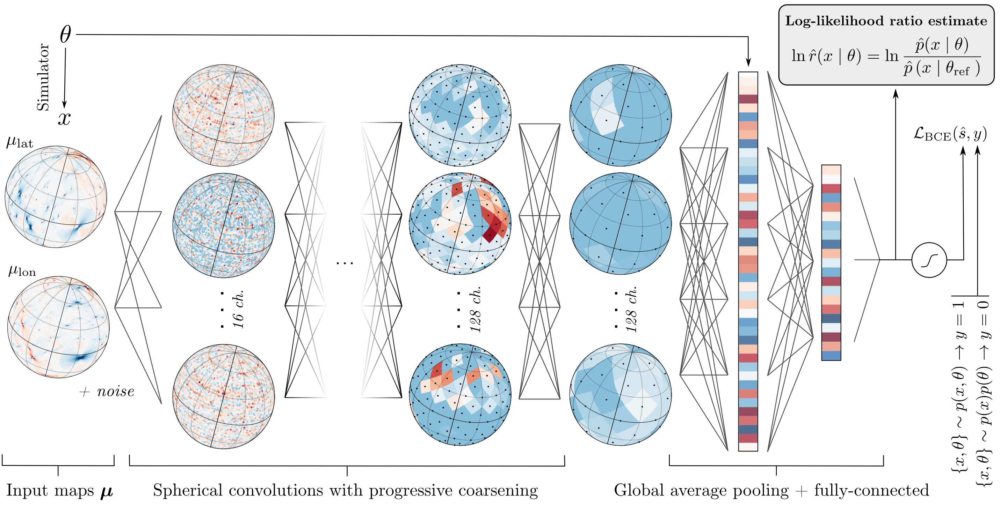

# Inferring dark matter substructure with astrometric lensing

[Siddharth Mishra-Sharma](smsharma@mit.edu)

[](https://www.gnu.org/licenses/agpl-3.0)
[](https://arxiv.org/abs/2110.xxxxx)



## Abstract

Astrometry&mdash;the precise measurement of positions and motions of celestial objects&mdash;has emerged as a promising avenue for characterizing the dark matter population in our Galaxy. By leveraging recent advances in simulation-based inference and neural network architectures, we introduce a novel method to search for global dark matter-induced gravitational lensing signatures in astrometric datasets. Our method based on neural likelihood-ratio estimation shows significantly enhanced sensitivity to a cold dark matter population and more favorable scaling with measurement noise compared to existing approaches based on two-point correlation statistics, establishing machine learning as a powerful tool for characterizing dark matter using astrometric data. 

## Code

**Note:** This code uses a custom version of PyGSP, which can be installed as follows:
```
git clone https://github.com/smsharma/pygsp.git -b sphere-graphs
cd pygsp
python setup.py install
```

- [simulate.py](simulate.py) produces full-sky astrometric maps for training. In the [scripts](scripts/) folder, `sbatch --array=0-999 simulate.sh` parallelizes sample generation in a SLURM HPC environment.
- [combine_samples.py](combine_samples.py) combines the generated samples into single files in order to use them for training. [scripts/combine_samples.sh](scripts/combine_samples.sh) submits this as a SLURM job.
- [train.py](train.py) trains the likelihood-ratio estimator. Experiments are managed using `MLflow'. [scripts/submit_train.py](scripts/submit_train.py) submits SLURM scripts over a possible grid of configurations; see options in [train.py](trian.py).

This [notebooks](notebooks/01_analysis.ipynb) analyzes the results and produces the plots in the paper. There, trained neural networks are loaded using their saved `MLflow` IDs.

## Citation

```
@article{Mishra-Sharma:2021xyz,
      author         = "Mishra-Sharma, Siddharth",
      title          = "{Inferring dark matter substructure with astrometric lensing beyond the power spectrum}",
      year           = "2021",
      eprint         = "2110.xxxxx",
      archivePrefix  = "arXiv",
      primaryClass   = "astro-ph.CO",
      SLACcitation   = "%%CITATION = ARXIV:2110.xxxxx;%%"
}
```

The repository contains 
- Code that is part of [sbi](https://github.com/mackelab/sbi) for inference,
- [Code](https://github.com/smsharma/astrometry-lensing-correlations) associated with [2003.02264](https://arxiv.org/abs/2003.02264) for forward modeling, 
- [Code](https://github.com/smsharma/mining-for-substructure-lens) associated with [1909.02005](https://arxiv.org/abs/1909.02005) for scripting and data processing, and
- [Code](https://github.com/deepsphere/deepsphere-pytorch) associated with [2012.15000](https://arxiv.org/abs/2012.15000) for constructing the feature extractor network.